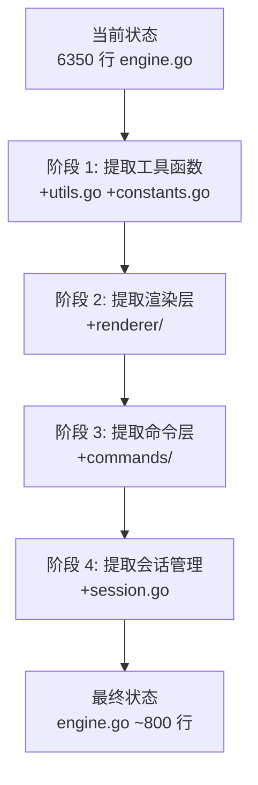

# Engine 重构方案

## 现状分析

`engine.go` 文件目前约 6350 行，包含 180 个方法，主要分为以下功能域：

### 功能域分布

1. **命令处理层** (~2000 行，行号 4308-6246)
   - 会话管理：`cmdNew`, `cmdList`, `cmdSwitch`, `cmdName`, `cmdCurrent`
   - 状态查询：`cmdStatus`, `cmdHistory`, `cmdUsage`, `cmdWhoami`
   - 模型配置：`cmdModel`, `cmdReasoning`, `cmdMode`, `cmdProvider`
   - 显示配置：`cmdLang`, `cmdQuiet`
   - 高级功能：`cmdMemory`, `cmdCron*`, `cmdCommands*`, `cmdAlias*`, `cmdSearch`
   - 系统工具：`cmdShell`, `cmdDiff`, `cmdShow`, `cmdDir`
   - 运维命令：`cmdDoctor`, `cmdUpgrade`, `cmdRestart`, `cmdHeartbeat`, `cmdCompress`
   - 删除功能：`cmdDelete*`

2. **渲染层** (~300-400 行)
   - `render*Card` 方法：`renderListCard`, `renderStatusCard`, `renderHistoryCard`, `renderModelCard`, `renderModeCard`, `renderLangCard`, `renderCronCard`, `renderCommandsCard`, `renderConfigCard`, `renderAliasCard`, `renderDeleteModeCard`, `renderSkillsCard`, `renderHelpCard`, `renderWhoamiCard`

3. **核心引擎** (~3000 行)
   - `Engine` 结构体定义
   - 消息处理：`handleMessage`, `processInteractiveMessage`
   - 会话管理：`cleanupInteractiveState`, `getOrCreateDeleteModeState`
   - 平台通信：`reply`, `replyWithCard`, `replyWithButtons`
   - Agent 交互：`startSession`, `sendToAgent`

4. **辅助函数** (~500 行)
   - `filterOwnedSessions`, `parseDeleteModeSelectedIDs`, `splitHelpTabRows`
   - `langDisplayName`, `formatDurationI18n`, `splitCardTitleBody`
   - `extractUserID`, `extractChannelID`, `extractPlatformName`
   - `splitMessage`, `truncateIf`, `truncateStr`
   - 正则解析、token 估算、上下文指示器

---

## 方案 A：按功能域水平拆分（推荐）

### 核心思路

将 `engine.go` 按功能域拆分为多个独立文件，保持同一个 `core` 包，但通过文件组织提高可维护性。

### 目标目录结构

```
tc-connect/core/
├── engine.go           # 核心引擎调度器 (~800 行)
│   ├── Engine struct 定义
│   ├── NewEngine()
│   ├── handleMessage() - 消息入口
│   ├── processInteractiveMessage()
│   ├── 平台通信方法 (reply, replyWithCard 等)
│   └── 依赖注入接口定义
│
├── session.go          # 会话管理 (~400 行)
│   ├── cleanupInteractiveState()
│   ├── getOrCreateDeleteModeState()
│   ├── interactiveState 相关逻辑
│   └── Session 结构体操作
│
├── commands/           # 命令处理包 (~2000 行)
│   ├── session.go      # 会话命令
│   │   ├── cmdNew, cmdList, cmdSwitch, cmdName, cmdCurrent
│   │   └── matchSession()
│   ├── status.go       # 状态查询
│   │   ├── cmdStatus, cmdHistory, cmdUsage, cmdWhoami
│   │   └── formatWhoamiText()
│   ├── config.go       # 配置命令
│   │   ├── cmdLang, cmdQuiet, cmdModel, cmdReasoning, cmdMode
│   │   ├── cmdProvider, cmdConfig, cmdConfigReload
│   │   └── 模型解析辅助函数 (parseModelSwitchArgs, resolveModelSwitchTarget 等)
│   ├── tools.go        # 工具命令
│   │   ├── cmdMemory, cmdCron*, cmdCommands*, cmdAlias*
│   │   ├── cmdSearch
│   │   └── 子命令处理 (cmdCronAdd, cmdCronList, cmdCronDel 等)
│   ├── admin.go        # 系统命令
│   │   ├── cmdShell, cmdDiff, cmdShow, cmdDir
│   │   ├── cmdDoctor, cmdUpgrade, cmdRestart, cmdHeartbeat
│   │   └── cmdCompress
│   ├── delete.go       # 删除功能
│   │   ├── cmdDelete, cmdDeleteBatch
│   │   ├── deleteSingleSession(), deleteSingleSessionReply()
│   │   └── 删除模式 UI 逻辑
│   ├── router.go       # 命令路由
│   │   ├── CommandHandler 接口
│   │   ├── CommandRegistry
│   │   └── 命令注册表
│   └── helpers.go      # 命令辅助函数
│       ├── isExplicitDeleteBatchArg(), parseDeleteBatchIndices()
│       ├── matchSubCommand()
│       └── 参数解析函数
│
├── renderer/           # 渲染包 (~500 行)
│   ├── cards.go        # Card 渲染
│   │   ├── renderListCard, renderCurrentCard, renderStatusCard
│   │   ├── renderHistoryCard, renderModelCard, renderModeCard
│   │   ├── renderLangCard, renderCronCard, renderCommandsCard
│   │   ├── renderConfigCard, renderAliasCard, renderDeleteModeCard
│   │   ├── renderSkillsCard, renderHelpCard, renderWhoamiCard
│   │   └── CardBuilder 结构体
│   ├── helpers.go      # 渲染辅助
│   │   ├── splitCardTitleBody()
│   │   ├── splitHelpTabRows()
│   │   └── supportsCards()
│   └── types.go        # 渲染类型定义
│
├── utils.go            # 通用工具 (~500 行)
│   ├── filterOwnedSessions()
│   ├── parseDeleteModeSelectedIDs()
│   ├── 时间格式化：formatDurationI18n(), cronTimeFormat()
│   ├── 字符串处理：splitMessage(), truncateIf(), truncateStr()
│   ├── 提取函数：extractUserID(), extractChannelID(), extractPlatformName()
│   ├── 语言显示：langDisplayName()
│   ├── 正则解析：parseSelfReportedCtx()
│   ├── Token 估算：estimateTokensWithPendingAssistant(), contextIndicator()
│   └── 判断函数：isApproveAllResponse(), isAllowResponse(), isDenyResponse()
│
├── types.go            # 类型定义
│   ├── Engine struct (保留核心字段)
│   ├── Platform interface
│   ├── Message struct
│   ├── AgentSessionInfo
│   ├── HistoryEntry
│   ├── Card, CardSection, CardButton 等
│   └── 其他数据结构
│
├── i18n.go             # 国际化消息定义
│   └── MsgNewSessionCreated, MsgSwitchSuccess 等
│
└── constants.go        # 常量定义
    ├── maxPlatformMessageLen, maxQueuedMessages
    ├── slowPlatformSend, slowAgentStart 等阈值
    └── listPageSize
```

### 依赖注入设计

定义接口抽象 `Engine` 的依赖：

```go
// core/types.go

type CommandContext interface {
    // 会话管理
    Sessions() SessionManager
    Agent() Agent
    I18n() I18nHandler
    
    // 平台通信
    Reply(p Platform, ctx string, msg string)
    ReplyWithCard(p Platform, ctx string, card Card)
    ReplyWithButtons(p Platform, ctx string, text string, buttons [][]ButtonOption)
    
    // 状态管理
    CleanupInteractiveState(key string)
    GetConfigItems() []ConfigItem
    
    // 其他依赖
    CronScheduler() *CronScheduler
    Commands() *CommandRegistry
    AdminUsers() []string
    CurrentLang() Language
}
```

### 实施步骤

#### 阶段 1：提取辅助函数（低风险）
1. 创建 `utils.go`，移动所有独立辅助函数
2. 创建 `constants.go`，集中常量定义
3. 创建 `types.go`，集中类型定义
4. 运行测试确保无影响

#### 阶段 2：提取渲染层（中低风险）
1. 创建 `renderer/` 包
2. 提取所有 `render*Card` 方法
3. 定义 `Renderer` 接口注入到 `Engine`
4. 修改 `Engine` 持有 `*renderer.Engine` 而非直接实现方法

#### 阶段 3：提取命令层（中风险，但收益最大）
1. 创建 `commands/` 包
2. 定义 `CommandHandler` 接口：
   ```go
   type CommandHandler interface {
       Handle(p Platform, msg *Message, args []string)
   }
   ```
3. 将每个 `cmd*` 方法转换为独立 struct（如 `NewCommand`, `ListCommand`）
4. 创建 `CommandRegistry` 管理命令注册
5. 在 `handleMessage` 中使用 registry 分发而非 switch-case

#### 阶段 4：提取会话管理（中风险）
1. 创建 `session.go`，提取 `interactiveState` 相关逻辑
2. 定义 `SessionManager` 接口
3. 将 `cleanupInteractiveState` 等移到独立包

#### 阶段 5：精简 `engine.go`（低风险）
1. 此时 `engine.go` 应仅保留消息路由和核心协调逻辑
2. 移除所有已提取的代码，替换为接口调用

### 优点
- ✅ **渐进式重构**：每个阶段独立，可随时回滚
- ✅ **测试友好**：命令处理可独立测试
- ✅ **职责清晰**：每个文件专注单一职责
- ✅ **编译安全**：同包内重构，编译失败立即发现

### 缺点
- ⚠️ **包内耦合**：仍在同一个 `core` 包，无法完全解耦
- ⚠️ **接口侵入性**：需要修改现有 `cmd*` 方法签名

---

### 实施路线图



### 关键决策点

在开始实施前，需要决定：

1. **依赖注入方式**：接口注入 vs 结构体嵌入 vs 全局变量
2. **命令注册机制**：静态注册（编译期）vs 动态注册（运行期）
3. **错误处理**：统一错误类型 vs 包内错误
4. **日志策略**：全局 slog vs 组件级日志上下文

---

## 技术细节

### 命令注册示例

```go
// commands/router.go
type Registry struct {
    commands map[string]CommandHandler
}

type CommandHandler interface {
    Handle(ctx CommandContext, args []string)
}

// commands/session/new.go
type NewCommand struct{}

func (c *NewCommand) Handle(ctx CommandContext, args []string) {
    sessions := ctx.Sessions()
    key := ctx.CurrentMessage().SessionKey
    // ... 业务逻辑
}

// 注册
func init() {
    registry.Register("new", &NewCommand{})
    registry.Register("list", &ListCommand{})
}
```

### 渲染器示例（方案 A）

```go
// renderer/cards.go
type CardRenderer struct {
    i18n i18n.Handler
}

func (r *CardRenderer) RenderListCard(sessionKey string, page int) (core.Card, error) {
    // 构建 Card 的逻辑
}
```

---

## 注意事项

1. **保持向后兼容**：如果 `Engine` 被其他包使用，保持方法签名不变
2. **测试覆盖**：重构前确保有集成测试覆盖主要路径
3. **版本控制**：每个阶段提交前创建备份分支
4. **文档同步**：更新 `engine.md` 反映新结构
5. **代码审查**：跨文件移动需要严格审查避免遗漏

---

**文档版本**: v1.0  
**创建日期**: 2026-06-17  
**状态**: 待评审
